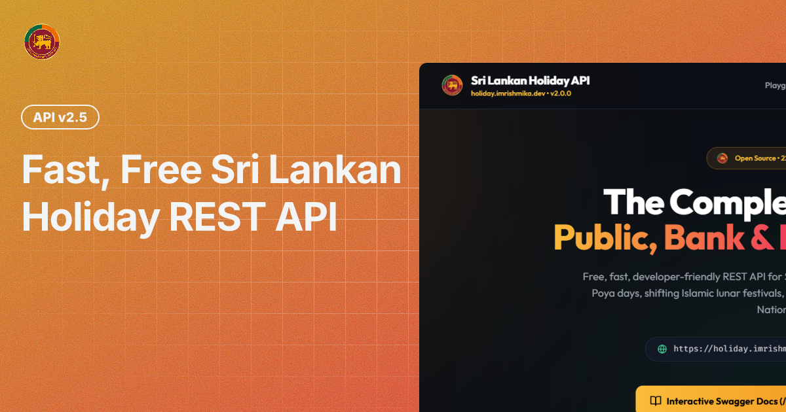

# 🇱🇰 Sri Lankan Holiday API (v3.0.0-Beta / v2 Active)



[](https://nextjs.org/)
[](https://holiday.imrishmika.dev)
[](https://opensource.org/licenses/MIT)
[](https://holiday.imrishmika.dev)
[](https://vercel.com)
[](https://holiday.imrishmika.dev)

A fast, free, open-source REST API & Interactive Web Dashboard serving comprehensive Sri Lankan public, bank, and Poya holiday data for **2024 through 2045** (22 years / 858+ holidays).

Built with **Next.js 14 (App Router)**, **TypeScript**, **Tailwind CSS**, and a **Native Next.js API Reference Portal**. Deploys seamlessly to Vercel with built-in DDoS edge protection and security middleware.

---

## 🌐 Live URLs

- 🏠 **Web Landing Page & Playground**: [https://holiday.imrishmika.dev](https://holiday.imrishmika.dev)
- 📖 **Interactive API Documentation**: [https://holiday.imrishmika.dev/docs](https://holiday.imrishmika.dev/docs)
- 🔌 **API Base Endpoint**: [https://holiday.imrishmika.dev/api](https://holiday.imrishmika.dev/api)
- 📦 **GitHub Repository**: [https://github.com/RishBroProMax/holiday-api](https://github.com/RishBroProMax/holiday-api)

---

## ✨ Key Features & Version Highlights

- 📅 **858+ Holidays Cataloged**: Complete coverage across 22 years (2024–2045).
- 🌕 **Astronomically Computed Poya Days**: Full Moon Poya dates calculated using the Jean Meeus lunar phase algorithm for Sri Lanka standard time (`Asia/Colombo`).
- 🕉️☪️✝️☸️ **Multi-Religious & National Coverage**: Buddhist, Hindu, Islamic, Christian, National, and International observances.
- ⚡ **API v2 / v3 Beta Features**:
  - `GET /api/v2/holidays`: Advanced search (`?search=poya`), multi-field filters, sorting (`sort=date_asc`), and pagination (`page`, `limit`).
  - `GET /api/v2/holidays/upcoming`: Multi-upcoming holiday support (`?limit=5`).
  - `GET /api/v2/holidays/search`: Full-text search engine (`?q=poya`).
  - `GET /api/v2/holidays/stats`: Dataset distribution analytics & live telemetry.
- 🛡️ **DDoS Protection & Rate Limiting**: Edge sliding-window rate limiter (60 req/min per IP) and production HTTP security headers (`HSTS`, `X-Frame-Options`, `X-Content-Type-Options`).
- 🤖 **AI Vibe Coder Prompt**: Master System Prompt included for ChatGPT, Cursor, Claude Code, and Antigravity.
- 📥 **Dataset Export**: One-click download buttons for full dataset in **JSON** or **CSV** format.
- 🔓 **100% Open-Source & Free**: CORS enabled, zero database requirements.

---

## 📌 API Endpoints

### API v2 (3.0 Beta - Recommended)

Base URL: `https://holiday.imrishmika.dev`

| Method | Endpoint | Description |
|:---|:---|:---|
| `GET` | `/api/v2/holidays` | Advanced search, pagination (`page`, `limit`), sort (`date_asc`, `date_desc`), Poya filter |
| `GET` | `/api/v2/holidays/upcoming` | Get next N upcoming holidays from today (`?limit=5`) |
| `GET` | `/api/v2/holidays/search` | Dedicated full-text search endpoint (`?q=poya`) |
| `GET` | `/api/v2/holidays/stats` | Analytics & live telemetry metrics |

### API v1 (Legacy Stable)

| Method | Endpoint | Description |
|:---|:---|:---|
| `GET` | `/api` | Base API overview & endpoint listing |
| `GET` | `/api/v1/holidays` | List holidays (filters: `year`, `month`, `type`, `category`, `public`, `bank`) |
| `GET` | `/api/v1/holidays/upcoming` | Get next upcoming holiday from today in Sri Lanka |
| `GET` | `/api/v1/holidays/today` | Check if today is a public holiday in Sri Lanka |
| `GET` | `/api/v1/holidays/export` | Export full dataset in `json` or `csv` format |
| `GET` | `/api/v1/health` | Health & system diagnostics endpoint |

---

## 💡 Quick cURL Example

### Get Next 3 Upcoming Holidays (v2 API)
```bash
curl "https://holiday.imrishmika.dev/api/v2/holidays/upcoming?limit=3"
```

---

## 📄 License

[MIT License](LICENSE) © 2026 [imrishmika.dev](https://imrishmika.dev) • [RishBroProMax](https://github.com/RishBroProMax)
